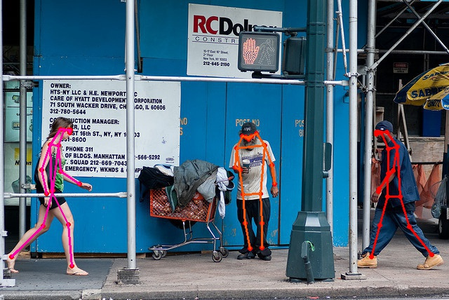

# SMPR

Code repository for the paper [SMPR: Single-Stage Multi-Person Pose Regression](https://arxiv.org/abs/2006.15576), by Junqi Lin, Huixin Miao, Junjie Cao, Zhixun Su and Risheng Liu.




## Getting Started

conda create -n mmdet python=3.7

conda activate mmdet

conda install pytorch=1.4.0 cudatoolkit=10.1 torchvision=0.5.0

pip install cython

git clone https://github.com/cocodataset/cocoapi.git

cd cocoapi/PythonAPI

python setup.py build_ext --inplace

python setup.py build_ext install

pip install -r requirements.txt

pip install Pillow==6.2.2

pip install -v -e .

## Data preprocessing 

put train2017 and val2017 in data/coco

put person_keypoints_train2017.json and person_keypoints_val2017.json in data/coco/annotations

cd data/coco/annotations

% generate 'person_keypoints_train2017_pesudobox.json'

python pesudo_box_train.py

% generate 'person_keypoints_val2017_pesudobox.json'

python pesudo_box_val.py


## Pretrained Models

You can download the trained model on [Baidu Yun](https://pan.baidu.com/s/1S_7s_tfIHlqvCCKWFXyWGA)，with the extraction code：aaaa

## Inference

You can now evaluate the models on the COCO val2017 split:

```
./tools/dist_test.sh configs/SMPR/ResNet_50.py work_dirs/r50.pth 4 --eval keypoints --options "jsonfile_prefix=./work_dirs/r50"
```

## Acknowledgment

We would like to thank MMDetection team for producing this great object detection toolbox!

